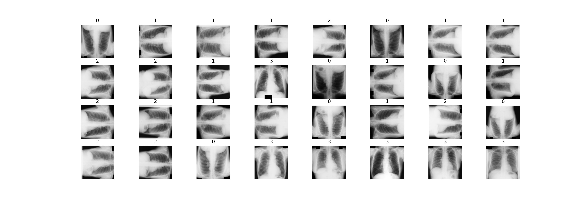
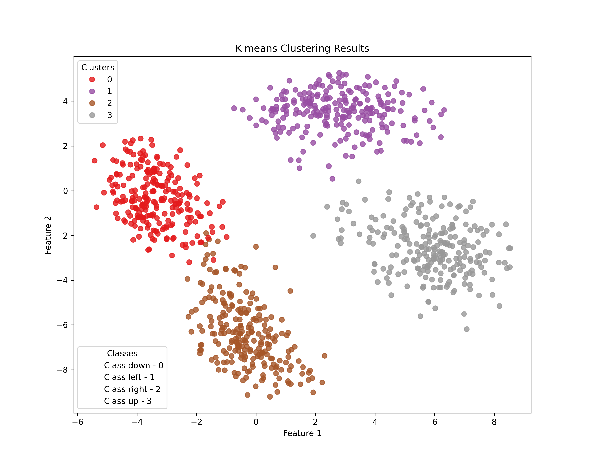
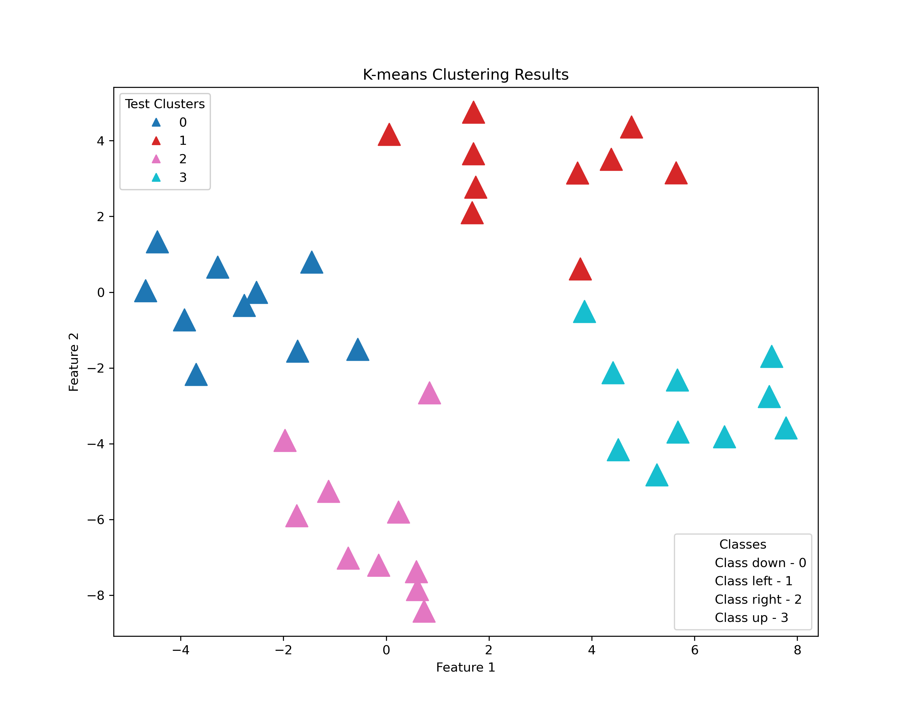
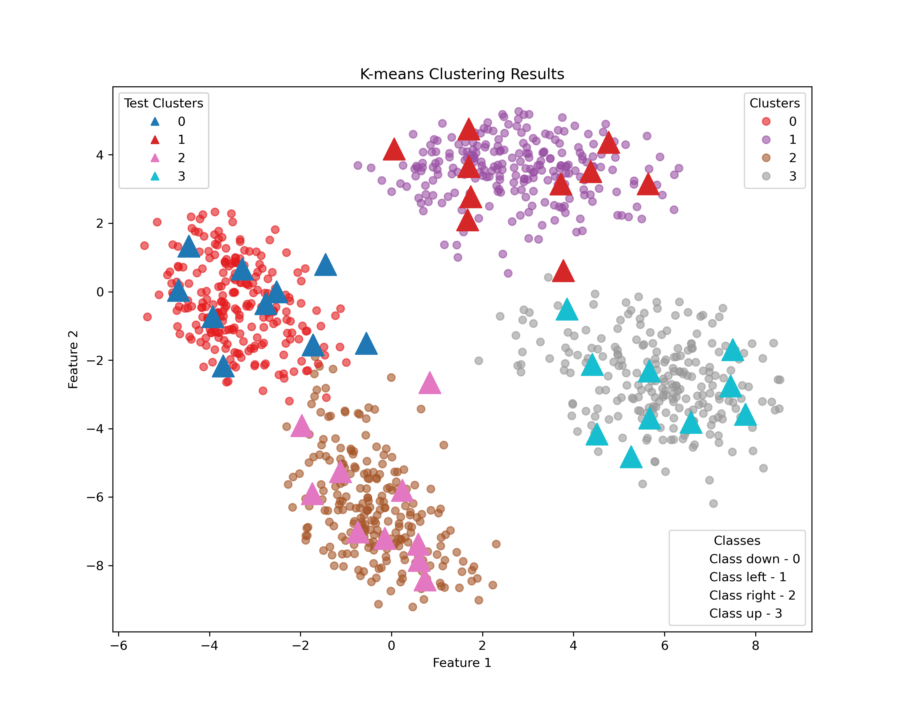

# X-Ray Image Clustering using K-Means Algorithm

## Overview

This repository contains code for clustering X-ray images using the K-Means algorithm. The dataset used for this project consists of flipped X-ray images, and the clustering is performed to group similar images together.

## Getting Started
1. **Clone the repository:**

   ```bash
   git clone https://github.com/anirudh6415/Clustering_Xray-s.git
   cd Clustering_Xray-s
2. **Install dependencies:**
   - pip install Python3
   - pip install torch
   - pip install opencv-python
   - pip install matplotlib
  
## Results 
### Cluster Visualization

You can visualize the clustered X-ray images with the following images:

*K-means prediction labels*




